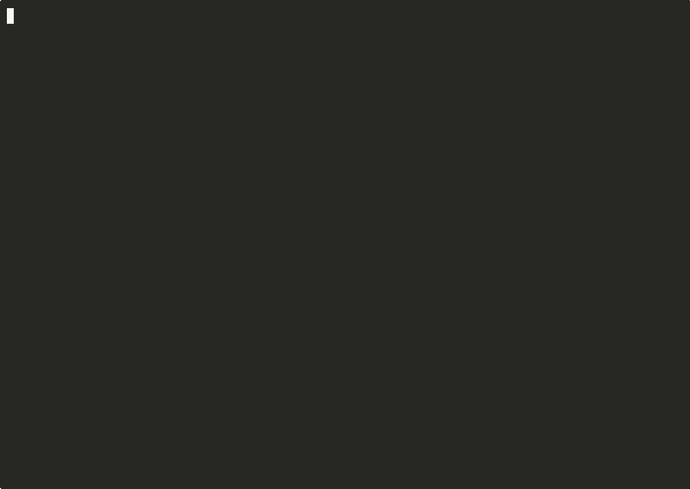
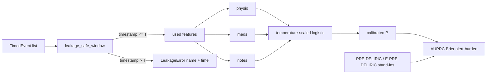

# delirium-watch

Multimodal early warning for ICU delirium onset. Retrospective research
on de-identified or synthetic data. Not for clinical deployment. Not a
medical device. Not for patient care.

[](https://github.com/techiegoku2623/delirium-watch/actions/workflows/ci.yml)
[](pyproject.toml)
[](LICENSE)




Regenerable terminal video: `make record`. [Full mp4](demo/out/delirium-watch-demo.mp4). Per-shot loops live in `demo/out/`. See `demo/README.md`.

## Status

| Phase | Deliverable | Status |
| --- | --- | --- |
| 0 | Research memo and harnesses | Merged — docs/phase-0/research-memo.md |
| 1 | Architecture, schemas, data contracts | Merged — docs/ARCHITECTURE.md |
| 2 | First vertical slice | Merged |
| 3 | Evaluation and demo | Merged — demo/*.cast |

Status values: Not started / In progress / In review / Merged.

## The problem this solves

ICU delirium is still caught after the patient is already CAM-positive,
restrained, or given an antipsychotic. A forecast that uses only data
available at time t, at a declared 6 / 12 / 24 hour horizon, is a
different object from a detection score. Published MIMIC models often
skip that distinction: they mix three incompatible labels, they allow
post-cutoff chart time, and they treat nursing notes as optional color.

This repo measures those three problems before it trains a model. It is
research tooling. It is not a medical device, not a diagnostic, and not
for patient care. No MIMIC-IV data is committed. Synthetic cohort only.

## Walkthrough

No credentials. `PATH=$HOME/.local/bin:$PATH`.

```bash
make setup && make demo
```

`make demo` runs `delirium-watch demo`: generate the seeded cohort,
compare three labels, predict P001 at 12h with stream attribution, and
show the leakage audit finding. Actual stdout (abridged to the
commands; wrapping is from the 140-column console):

```
delirium-watch demo  (synthetic only; no credentials)

Wrote 50 synthetic patients to data/sample
Parquet: data/sample/cohort.parquet
Included: 49   Excluded (comfort care): 1
  excluded ids: P004
label           n+   prevalence
cam_icu         24   0.490
antipsychotic   21   0.429
restraint       18   0.367
Synthetic only. No MIMIC bytes. Not a population incidence.
Research tool only. Retrospective analysis on synthetic or de-identified
data. This is not a medical device, not a diagnostic, and not for
patient care or clinical deployment.
```

### Step 1 — seeded cohort and three labels

```bash
make demo-data
delirium-watch labels compare --cohort data/sample/cohort.parquet
```

Actual stdout from `labels compare`:

```
delirium-watch labels compare
cohort: data/sample/cohort.parquet
raw n=50  included n=49  excluded n=1
prevalence (included): CAM-ICU=0.490  antipsychotic=0.429  restraint=0.367
pair                         n  both+  left only  right only  neither  agreement  kappa
cam_icu vs antipsychotic    49     10         14          11       14      0.490 -0.023
cam_icu vs restraint        49      8         16          10       15      0.469 -0.067
antipsychotic vs restraint  49      7         14          11       17      0.490 -0.061
Mean pairwise kappa: -0.050
Label choice dominates downstream results (mean kappa < 0.60). The three
definitions stay competing endpoints.
```

Recording: `demo/01-cohort-and-labels.cast`.

### Step 2 — predict at T, explain three streams

```bash
delirium-watch predict --patient P001 --horizon 12 --explain
```

Actual stdout:

```
delirium-watch predict
patient: P001  role: prodrome_positive
horizon: 12h  cutoff T: 2024-01-03T00:00:00
Hard temporal cutoff: features use only events with timestamp <= T.
latest used timestamp: 2024-01-02 22:00:00
calibrated P(onset by T+12h): 0.959
raw logit: 3.622  temperature: 1.15  (Brier is reported by `make eval`, not a raw score)
stream  contribution  features
physio        +3.472  hr_last=118.0  hr_delta=30.0  rass=1.0  temp_c=38.1
meds          +0.000  anticholinergic_burden=0.0
notes         +1.650  notes_signal=1
PRE-DELIRIC stand-in (publication formula on synthetic features): 0.117
  — van den Boogaard et al., BMJ 2012;344:e420 (formula stand-in)
E-PRE-DELIRIC stand-in (publication formula on synthetic features): 0.247
  — Wassenaar et al., Intensive Care Med 2015;41:1048–1056 (formula stand-in)
Research tool only. ... not for patient care or clinical deployment.
```

Latest used timestamp is before T. Recording: `demo/02-predict-explain.cast`.

### Step 3 — leakage audit (exits non-zero)

```bash
delirium-watch audit-leakage
```

The command injects `injected_post_cutoff_lactate` and names the
committed P005 `heart_rate` probe. It exits 1. Recording:
`demo/03-leakage-audit.cast`.

### Step 4 — evaluation

```bash
make eval
```

Horizon curve, calibration bins, AUPRC, subgroup table, alert-burden,
and both published-formula stand-ins (PRE-DELIRIC / E-PRE-DELIRIC) on
synthetic features. Recording: `demo/04-evaluation.cast`.

## Layout

Read in this order:

1. `docs/phase-0/research-memo.md` — why the defaults and the failure condition
2. `docs/ARCHITECTURE.md` — data contracts and the three streams
3. `data/sample/README.md` — why each demo stay exists
4. `docs/DATA.md` — MIMIC-IV credentialing (weeks); no MIMIC in git
5. `src/delirium_watch/features.py` — the leakage-safe window
6. `src/delirium_watch/model.py` — calibrated logistic + attribution
7. `src/delirium_watch/baselines.py` — PRE-DELIRIC / E-PRE-DELIRIC stand-ins
8. `research/phase0/` and `research/phase3/eval/` — measurements

## Results

Regenerated by `make eval`. Baseline column is mandatory.

<!-- EVAL_TABLE_BEGIN -->

| Measurement | Value | n | Notes |
| --- | --- | --- | --- |
| Mean pairwise label kappa | -0.050 | 49 | Label choice dominates |
| CAM-ICU prevalence (included) | 0.490 | 49 | Synthetic; not MIMIC-IV |
| Comfort-care excluded | 1 | 50 | P004 |
| Leakage rejected | heart_rate @ 2024-01-07T06:00:00 | P005 | Non-zero exit if used |
| 12h AUPRC (CAM-ICU, model) | 0.338 | 40 | Synthetic; not MIMIC-IV |
| 12h Brier (model) | 0.205 | 40 | Temperature-scaled logistic |
| 12h PRE-DELIRIC AUPRC (stand-in) | 0.291 | 40 | Publication formula on synthetic features |
| 12h E-PRE-DELIRIC AUPRC (stand-in) | 0.320 | 40 | Publication formula on synthetic features |
| Alert-burden @ 0.20 | 8.4/100-pt-days | 17 alerts | PPV 0.176 |

<!-- EVAL_TABLE_END -->

## 🏗️ Architecture & Event Topology



`TimedEvent` is the data that moves. Post-cutoff events never enter
`used`. Comfort-care stays never enter the analysis set.

## ⚖️ Architecture Trade-offs & Pragmatic Decisions

| Chosen | Given up | What would change the answer |
| --- | --- | --- |
| Three competing labels, no silent primary | A single "delirium" bit | A credentialed MIMIC extract with mean kappa ≥ 0.60 |
| Horizon as a 6/12/24h parameter | One undeclared window | Phase 3 calibration collapsing at 6h |
| Tested leakage-safe window | Notebook `WHERE charttime <= t` | A single used event with timestamp > t |
| Synthetic seeded cohort | Live MIMIC-IV | Credentialing complete + extract committed as a manifest |
| Publication-formula stand-ins | A port of the bedside calculators | A credentialed extract with the original variables |

## 🛡️ Edge Cases & Failure Modes

- P002: high ACB, no event. An ACB-threshold baseline must look bad here.
- P003: structured labels negative; ablating notes loses the case.
- P004: comfort care. Inclusion is a bug.
- P005: `heart_rate` at icu_intime+30h. Using it is a bug; the audit
  exits non-zero.
- Copied-forward CAM-ICU after cutoff is leakage, not a label.
- Antipsychotics for primary psychiatric disease stay in the AP label;
  we do not silently recode indication.
- Real MIMIC notes can contain residual identifiers; this repo never
  touches them.

## Limitations

This is not a bedside monitor and not for patient care. It does not
replace CAM-ICU. Numbers are synthetic. MIMIC-IV incidence is
unmeasured. PRE-DELIRIC / E-PRE-DELIRIC here are publication formulas
on synthetic stand-in features, not validated ports.

## License and citation

MIT. Cite Ely et al. on CAM-ICU, van den Boogaard et al. BMJ 2012 and
Wassenaar et al. Intensive Care Med 2015 for the stand-in formulas,
the MIMIC-IV PhysioNet release for any later credentialed extract, and
this repository for the harnesses. Do not cite the synthetic base rates
as clinical incidence.
