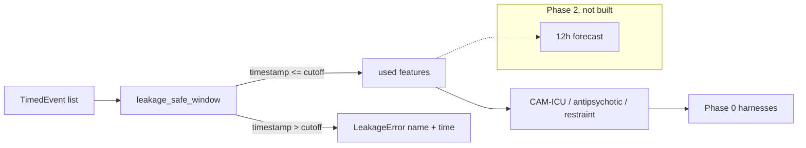

# delirium-watch

Multimodal early warning for ICU delirium onset. Retrospective research
on de-identified or synthetic data. Not for clinical deployment. Not a
medical device.

[](https://github.com/techiegoku2623/delirium-watch/actions/workflows/ci.yml)
[](pyproject.toml)
[](LICENSE)

## Status

| Phase | Deliverable | Status |
| --- | --- | --- |
| 0 | Research memo and harnesses | In review — docs/phase-0/research-memo.md |
| 1 | Architecture, schemas, data contracts | Not started |
| 2 | First vertical slice | Not started |
| 3 | Evaluation and demo | Not started |

Status values: Not started / In progress / In review / Merged.

## The problem this solves

ICU delirium is still caught after the patient is already CAM-positive,
restrained, or given an antipsychotic. A forecast that uses only data
available at time t, at a declared 6 / 12 / 24 hour horizon, is a
different object from a detection score. Published MIMIC models often
skip that distinction: they mix three incompatible labels, they allow
post-cutoff chart time, and they treat nursing notes as optional color.

This repo measures those three problems before it trains a model. It is
research tooling. It is not a medical device, not a diagnostic, and not
for clinical deployment. No MIMIC-IV data is committed.

## Walkthrough

Phase 0 ships the designed synthetic cohort and the measurement
harnesses. The `delirium-watch predict` command is reserved for Phase 2;
running it now is not implemented on purpose.

### Step 1 — designed synthetic cohort

```bash
make setup && make demo-data && make demo
```

`make demo` calls `delirium-watch demo-plan --dry-run`. Actual stdout:

```
delirium-watch designed synthetic patients

P001  prodrome_positive
  path:     clear physiological prodrome then CAM-ICU positive
  expected: CAM-ICU, antipsychotic, and restraint all fire. Vitals before
cutoff show the prodrome. Gold onset at 36h.

P002  high_acb_negative
  path:     high anticholinergic burden, no delirium event
  expected: All three labels negative. ACB sum is high before cutoff.
No CAM-ICU, antipsychotic, or restraint events.

P003  notes_only
  path:     nursing-note signal only; structured labels negative
  expected: CAM-ICU, antipsychotic, and restraint are all negative.
notes_signal() is true before cutoff. Gold onset at 20h from notes.

P004  comfort_care
  path:     comfort care — must be excluded
  expected: is_excluded() is true. Stay never enters label or base-rate
numerators.

P005  leakage_probe
  path:     post-cutoff heart_rate deliberately placed to trip leakage audit
  expected: leakage_safe_window raises LeakageError naming heart_rate at
icu_intime+30h. Non-zero exit if that event is ever used.

Research tool only. Retrospective analysis on synthetic or de-identified
data. This is not a medical device, not a diagnostic, and not for
clinical deployment.
```

The records are designed: a prodrome-positive stay, an ACB false-positive
pressure case, a notes-only case, a comfort-care exclusion, and a
leakage probe. See `data/sample/README.md`.

Recordings `demo/01-predict.cast` land in Phase 3.

### Step 2 — leakage-safe window (Phase 0, not a model)

```bash
make research
```

`research/phase0/leakage_audit/` injects post-cutoff data and confirms
the pipeline rejects it by feature name and timestamp. This is built
before any model.

### Step 3 — label disagreement (Phase 0)

The same `make research` run writes pairwise kappa for CAM-ICU,
antipsychotic, and restraint labels. If they disagree, label choice
dominates downstream results.

### Step 4 — reserved predict, then the measured baseline

```bash
delirium-watch predict --horizon 12
make eval
```

`delirium-watch predict` is reserved (Phase 2). `make eval` already
runs: it regenerates `docs/EVALUATION.md` from the Phase 0 harnesses.

## Layout

Read in this order:

1. `docs/phase-0/research-memo.md` — why the defaults and the failure condition
2. `data/sample/README.md` — why each demo stay exists
3. `docs/DATA.md` — MIMIC-IV credentialing (weeks); no MIMIC in git
4. `src/delirium_watch/features.py` — the leakage-safe window
5. `research/phase0/` — the three measurements behind the memo
6. `src/delirium_watch/cli.py` — demo-plan and demo-data only, until Phase 2

## Results

Regenerated by `make eval`. Baseline column is mandatory.

<!-- EVAL_TABLE_BEGIN -->

| Measurement | Value | n | Notes |
| --- | --- | --- | --- |
| Mean pairwise label kappa | -0.050 | 49 | Label choice dominates |
| CAM-ICU prevalence (included) | 0.490 | 49 | Synthetic; not MIMIC-IV |
| Comfort-care excluded | 1 | 50 | P004 |
| Leakage rejected | heart_rate @ 2024-01-07T06:00:00 | P005 | Non-zero exit if used |
| AUPRC / Brier / alert-burden | Phase 2 | — | Declared, not measured |

<!-- EVAL_TABLE_END -->

## 🏗️ Architecture & Event Topology



`TimedEvent` is the data that moves. Post-cutoff events never enter
`used`. Comfort-care stays never enter the analysis set.

## ⚖️ Architecture Trade-offs & Pragmatic Decisions

| Chosen | Given up | What would change the answer |
| --- | --- | --- |
| Three competing labels, no silent primary | A single "delirium" bit | A credentialed MIMIC extract with mean kappa ≥ 0.60 |
| Horizon as a 6/12/24h parameter | One undeclared window | Phase 3 calibration collapsing at 6h |
| Tested leakage-safe window | Notebook `WHERE charttime <= t` | A single used event with timestamp > t |
| Synthetic seeded cohort | Live MIMIC-IV in Phase 0 | Credentialing complete + extract committed as a manifest |
| Lexical note tokens | An embedding model | Notes-ablation still loses P003 after a model is added |

## 🛡️ Edge Cases & Failure Modes

- P002: high ACB, no event. An ACB-threshold baseline must look bad here.
- P003: structured labels negative; ablating notes loses the case.
- P004: comfort care. Inclusion is a bug.
- P005: `heart_rate` at icu_intime+30h. Using it is a bug; the audit
  exits non-zero.
- Copied-forward CAM-ICU after cutoff is leakage, not a label.
- Antipsychotics for primary psychiatric disease stay in the AP label;
  we do not silently recode indication.
- Real MIMIC notes can contain residual identifiers; Phase 0 never
  touches them.

## Limitations

This is not a bedside monitor. It does not replace CAM-ICU. Phase 0
classifies designed synthetic stays, not patients. MIMIC-IV incidence is
unmeasured. No model is fitted. No demo recording is committed.

## License and citation

MIT. Cite Ely et al. on CAM-ICU, the MIMIC-IV PhysioNet release for any
later credentialed extract, and this repository for the harnesses.
Do not cite the synthetic base rates as clinical incidence.
