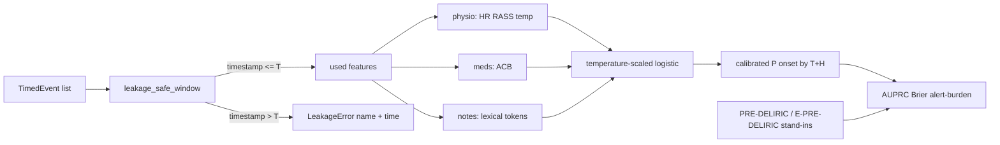

# Architecture — delirium-watch (Phase 1)

Not a medical device. Not for patient care. Synthetic cohort only.

## Data contracts

| Object | Grain | Rule |
| --- | --- | --- |
| `Patient` | one ICU stay | `P004` comfort-care never enters the analysis set |
| `TimedEvent` | one charted fact | `timestamp` is the only legal clock |
| `WindowResult` | one cutoff T | `used` contains only `timestamp <= T` |
| `LeakageFinding` | one illegal fact | names `feature` + `timestamp` |
| `cohort.parquet` | one stay per row | three competing labels, no MIMIC bytes |

Prediction at time T uses only events with `timestamp <= T`. The window
is in `src/delirium_watch/features.py`. Tests fail if a used event is
after T.

## Three streams

Horizons are 6 / 12 / 24 hours. Default reporting horizon is 12h.
Patients already positive at T are not forecast targets.

## Published baselines (stand-ins)

`src/delirium_watch/baselines.py` implements the published linear
predictors on synthetic stand-in features (age, a crude APACHE-like
score, temperature-as-infection, ventilation-as-respiratory-failure).
Urea and metabolic acidosis are unmeasured; documented defaults are
used and labelled. These are not validated bedside ports.

- PRE-DELIRIC: van den Boogaard et al., BMJ 2012;344:e420
- E-PRE-DELIRIC: Wassenaar et al., Intensive Care Med 2015;41:1048–1056

## CLI surface

| Command | Phase |
| --- | --- |
| `demo-data` | 1 — seeded cohort + parquet + counts |
| `labels compare --cohort …` | 1 — three defs + kappa |
| `predict --patient --horizon --explain` | 2 — calibrated P + stream attribution |
| `audit-leakage` | 2 — injected leak, non-zero exit, name+time |
| `eval` / `make eval` | 3 — horizon curve, calibration, subgroups, burden |

## What is not here

No MIMIC-IV bytes. No PhysioNet credentials. No FastAPI service. No
claim of clinical performance.
